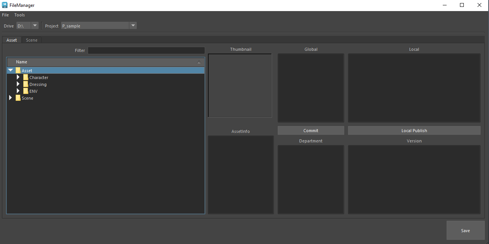
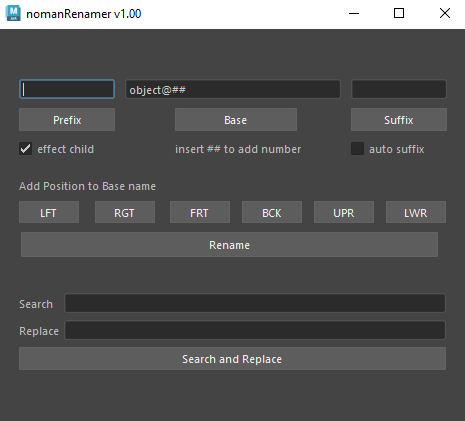

# nmTools 🛠️
### A Comprehensive Rigging & Animation Toolset for Autodesk Maya


**nmTools** is a curated collection of professional scripts designed to streamline the rigging and animation pipeline in Autodesk Maya. Developed to handle complex rigging tasks and daily animation workflows, it integrates both custom tools and respected open-source utilities into a unified interface.

---

## 🌟 Key Features

### 📂 Pipeline & File Management
*   **Custom File Manager**: Efficiently manage project scenes and versions.
*   **Asset Utilities**: Batch publish files, auto-thumbnail generation, and outliner organization.
*   **Texture Management**: Tools for path correction and texture search/replace.

### 🎭 Animation Tools
*   **Studio Library Integration**: Quick access to pose and animation libraries.
*   **Picker Support**: Integrated support for **DreamWall Picker** and **AnimSchool Picker**.
*   **Workflow Enhancers**: ZvParentMaster, Tweener, and Onion Skin Renderer.
*   **Technical Tools**: Snap IK/FK, Playblast Tool, and Controller Mirroring.

### 🦴 Rigging Toolset
*   **Skeleton & Joints**: Create joints at vertices, orient joints with Comet tools, and generate joints along curves.
*   **Skinning Suite**:
    *   **SkinWrangler** & **DoraWeight** integration.
    *   Custom weight import/export and smoothing tools.
    *   Recursive weight copying and rounding.
*   **Controller Generation**: Auto-create master groups, zero groups, and custom controller shapes.
*   **Blendshapes**: Advanced symmetrical and asymmetrical blendshape tools.
*   **AutoRig Templates**: Basic Biped and Quadruped joint templates to jumpstart your rigs.

---

## 📸 Previews

| File Manager | Renamer Tool |
| :---: | :---: |
|  |  |

---

## 🚀 Installation

### 1. Repository Setup
Clone or download this repository to your preferred tools directory (e.g., `D:/sysTools/nmTools_github`).

### 2. Configure Maya
To initialize **nmTools** on startup, add the following to your `userSetup.py`:

```python
import sys
import maya.utils
import importlib

# Add the python path (Change this to your actual path)
sys.path.append('D:/sysTools/nmTools_github/riggerTools/python')

# Import and run the menu (choose the version corresponding to your Maya)
from nmMenu import nmMenu2023 
importlib.reload(nmMenu2023)
maya.utils.executeDeferred('nmMenu2023.runMenu()')
```

### 3. Requirements
*   **Autodesk Maya 2018 - 2023+**
*   **PyMEL**: Ensure PyMEL is installed with your Maya distribution.

---

## 🛠️ Usage
Once installed, a new menu **"nmMenu"** will appear in your Maya main menu bar. From there, you can access all the rigging, animation, and pipeline utilities categorized by department.

---

## 🤝 Credits
This toolset includes and integrates several amazing community tools:
*   [Studio Library](https://www.studiolibrary.com/)
*   [SkinWrangler](https://github.com/chrisevans3d/skinWrangler)
*   [ZvParentMaster](http://www.creativecrash.com/maya/script/zv-parent-master)
*   Comet Scripts by Michael Comet
*   DoraSkinWeight by Hiroki Itoh


# If file name prefix is 'eh_' is mean ai generate file


---
*Developed with ❤️ by Narongtum*
